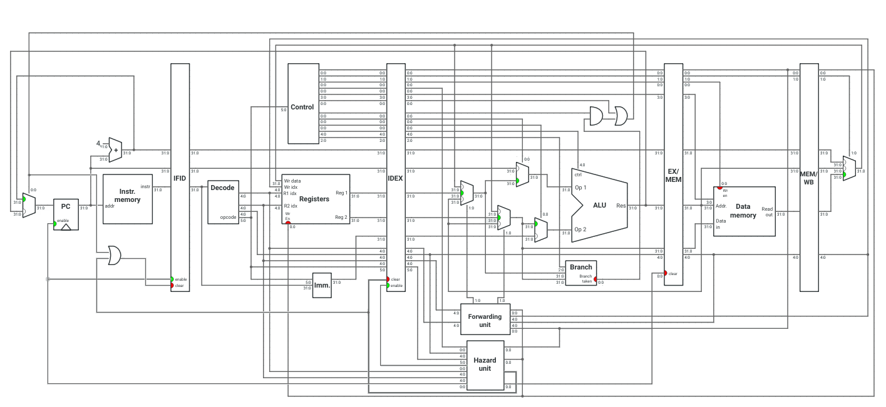

.. implementation.rst

    Copyright The GRISC Contributors.

    GRISC Documentation

    This work is licensed under the Creative Commons Attribution-ShareAlike 4.0
    International License. To view a copy of this license,
    visit http://creativecommons.org/licenses/by-sa/4.0/.

**************
Implementation
**************

The processor was implemented incrementally. First, the basic five-stage datapath was developed without its control unit, hazard detector, or forwarding logic.  Individual VHDL components and the integrated datapath were verified with testbenches. The control unit was then integrated and validated using the same approach. Finally, forwarding and hazard-detection blocks were added and tested.

Each block in the final diagram is an independent VHDL component, which keeps the datapath modular and makes individual blocks straightforward to test. The Ripes five-stage processor served as a behavioral reference throughout the implementation :cite:p:`ripes`.

Processor block diagram
***********************

   Final processor block diagram, including key ports and bus widths.

The five pipeline stages are IF, ID, EX, MEM, and WB. The design includes control logic, a forwarding unit, and a hazard detector to coordinate values and control flow as instructions advance through these stages.
