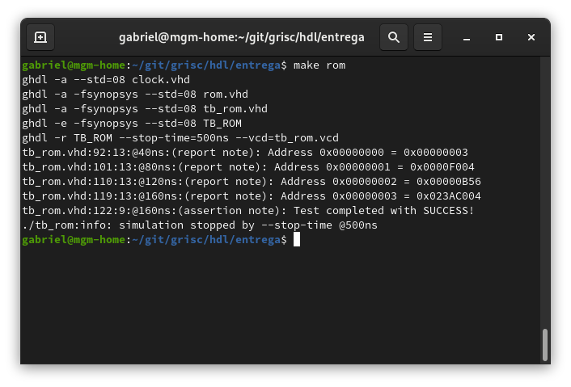
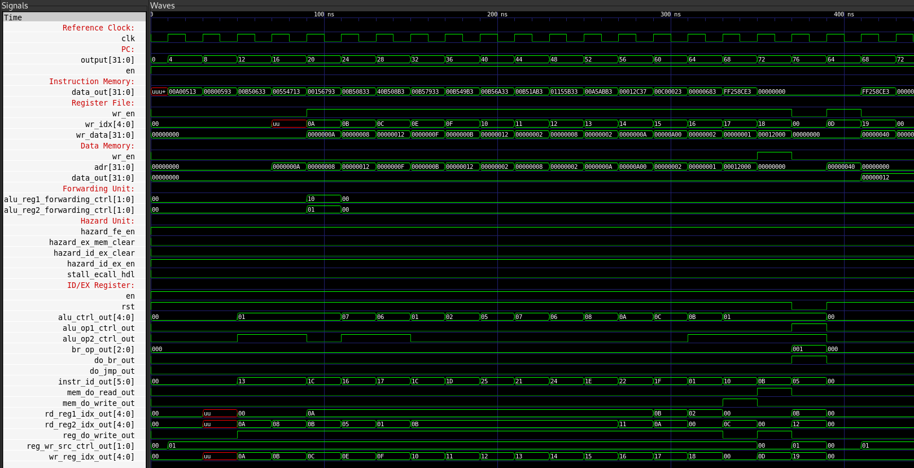
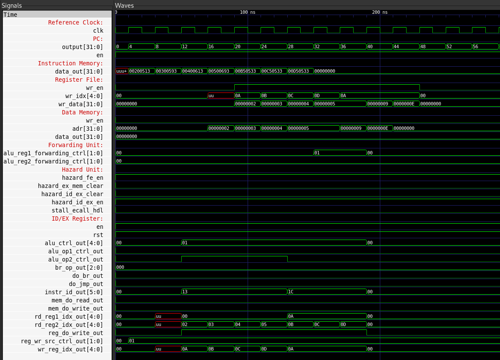
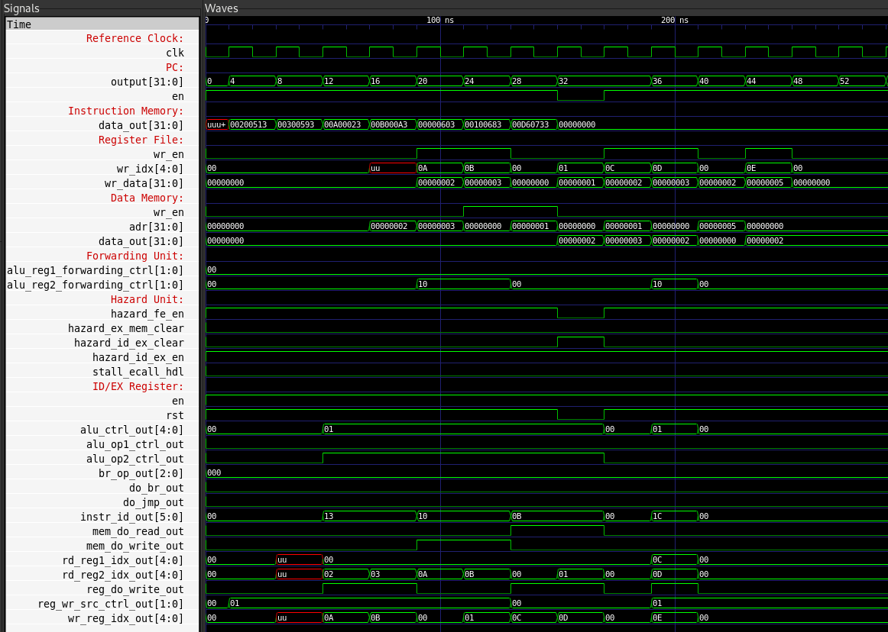
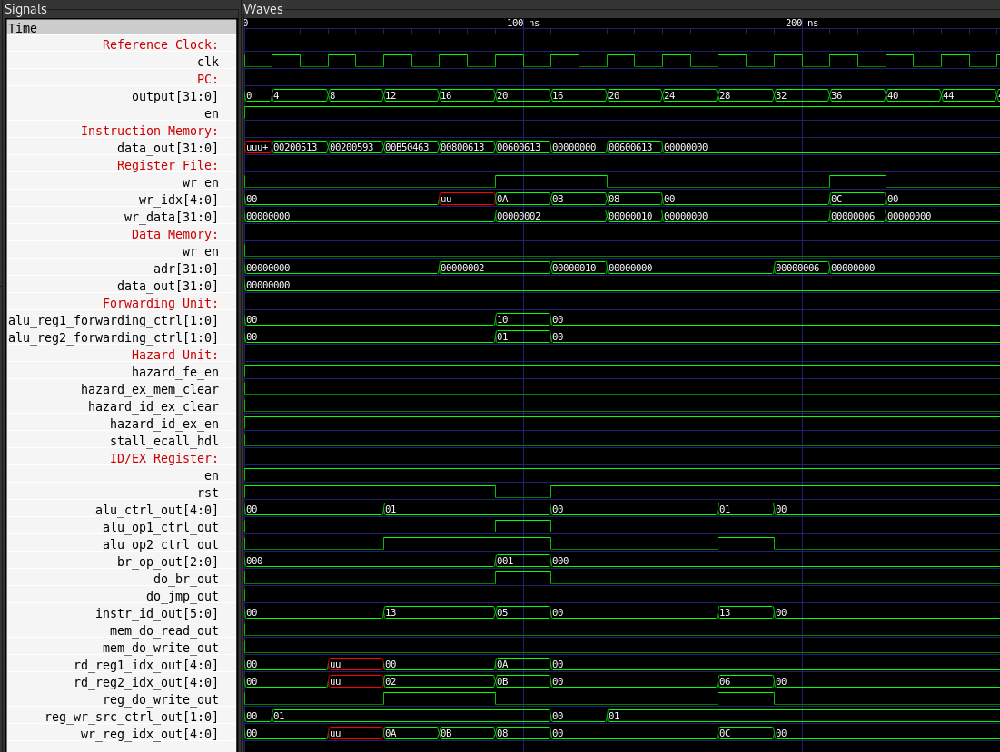

.. verification.rst

    Copyright The GRISC Contributors.

    GRISC Documentation

    This work is licensed under the Creative Commons Attribution-ShareAlike 4.0
    International License. To view a copy of this license,
    visit http://creativecommons.org/licenses/by-sa/4.0/.

***************************
Simulation and verification
***************************

Simulation environment
**********************

The project uses GHDL, an open-source VHDL analyzer, compiler, and simulator, to simulate the individual blocks and the complete processor :cite:p:`ghdl`. Test programs are loaded from files into simulated instruction memory. Test results can be written to text files or displayed in the simulator output.

   Example result from the instruction-memory (ROM) testbench.

Internal signals can also be inspected as waveforms with GTKWave :cite:p:`gtkwave`.

ISA test program
****************

The following Assembly program exercises a representative selection of the implemented ISA, including arithmetic, logical, memory, and branch instructions.

.. code-block:: asm

   addi x10, x0, 10
   addi x11, x0, 8
   add  x12, x10, x11
   xori x14, x10, 5
   ori  x15, x10, 1
   add  x16, x10, x11
   sub  x17, x10, x11
   and  x18, x10, x11
   xor  x19, x10, x11
   or   x20, x10, x11
   sll  x21, x10, x11
   srl  x22, x10, x17
   slt  x23, x11, x10
   lui  x24, 18
   test:
   sb   x12, 0(x0)
   lb   x13, 0(x0)
   beq  x11, x18, test

The program is converted to 32-bit hexadecimal machine instructions before it is loaded into instruction memory. The captured waveforms show the processor executing this program.

   Waveforms captured while running the ISA test program.

Forwarding
**********

Back-to-back dependent additions verify that the forwarding unit supplies a newly computed result to the next instruction without waiting for write-back.

.. code-block:: asm

   addi x10, x0, 2
   addi x11, x0, 3
   addi x12, x0, 4
   addi x13, x0, 5
   add  x10, x10, x11
   add  x10, x10, x12
   add  x10, x10, x13

   Waveforms from a forwarding test.

Data hazard
***********

The following sequence loads two bytes and immediately consumes the loaded values, exercising the data-hazard detection logic.

.. code-block:: asm

   addi x10, x0, 2
   addi x11, x0, 3
   sb   x10, 0(x0)
   sb   x11, 1(x0)
   lb   x12, 0(x0)
   lb   x13, 1(x0)
   add  x14, x12, x13

   Waveforms from a data-hazard test.

Branch control flow
*******************

This test verifies a taken ``beq`` branch. The assignment that would set ``x12`` to 8 is skipped; execution continues at ``test`` and sets it to 6.

.. code-block:: asm

   addi x10, x0, 2
   addi x11, x0, 2
   beq  x10, x11, test
   addi x12, x0, 8
   test:
   addi x12, x0, 6

   Waveforms from a branch-control-flow test.
